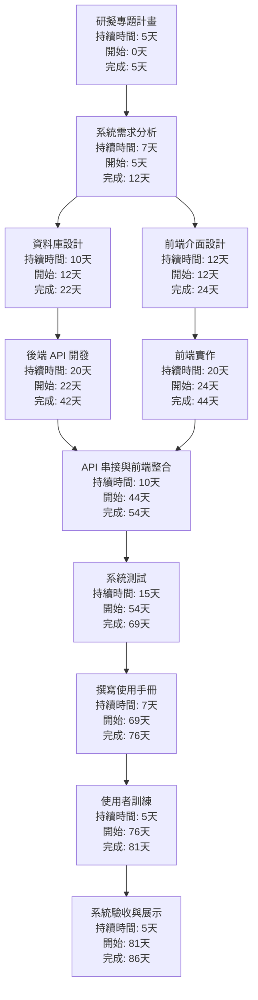
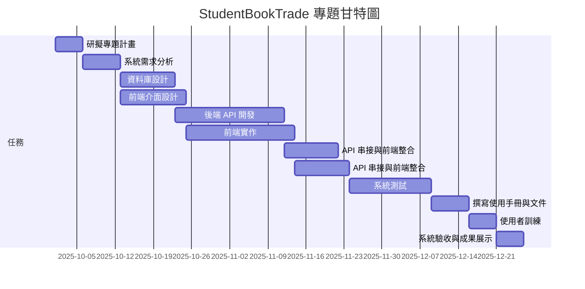

# HW2 – 專案管理 PERT/CPM 與甘特圖

## Step 1: 任務分解結構清單（WBS）

| 任務編號 | 任務描述                      | 需時 (天) | 前置任務 |
| ---- | ------------------------- | ------ | ---- |
| 1    | 研擬專題計畫                    | 5      | -    |
| 2    | 系統需求分析 (Use Case/DFD)     | 7      | 1    |
| 3    | 資料庫設計 (ERD/schema)        | 10     | 2    |
| 4    | 前端介面設計 (RWD 原型)           | 12     | 2    |
| 5    | 後端 API 開發 (Flask/Express) | 20     | 3    |
| 6    | 前端實作 (React/Vue)          | 20     | 4    |
| 7    | API 串接與前端整合               | 10     | 5,6  |
| 8    | 系統測試 (功能/使用者測試)           | 15     | 7    |
| 9    | 撰寫使用手冊與文件                 | 7      | 8    |
| 10   | 使用者訓練 (模擬操作教學)            | 5      | 9    |
| 11   | 系統驗收與成果展示                 | 5      | 10   |

---

## Step 2: PERT/CPM 網路圖

以下是整合的 PERT/CPM 網路圖，顯示任務相依關係和時間：

---

## Step 3: 甘特圖（時程規劃）

---

## Step 4: 關鍵路徑分析

經過 PERT/CPM 分析，本專題的 **關鍵路徑 (Critical Path)** 為：

**1 → 2 → 3 → 5 → 7 → 8 → 9 → 10 → 11**

此路徑總計需時 86 天，是決定整個專案完成時間的關鍵路徑。在這條路徑上的任何延遲都會直接影響專案的完成時間，因此需要特別注意這些任務的進度管理。

---

## 結論

本作業完成了以下幾個步驟：

1. 建立了包含11個任務的工作分解結構（WBS）清單
2. 繪製整合的 PERT/CPM 網路圖，展示了任務相依關係和時程
3. 製作甘特圖進行時程規劃，清楚顯示每個任務的開始和結束時間
4. 分析並找出關鍵路徑，確認專案的最短完成時間

透過這些工具的整合運用，我們可以更有效地規劃和控制專案進度。

---
